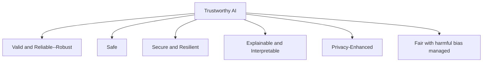
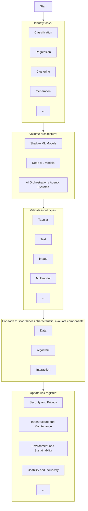

# AI Safety - Test Methodology

This methodology assumes that the tester has access to model training and inference APIs, but no internal mechanism information such as data sources and model architecture information.

Let's think about traditional risk-based testing in a system design process, we would consider:

- Test case generation,
- Test data generation,
- Test case execution,
- Test monitoring and control,
- Overall management of this process

It is standardised in ISO/IEC/IEEE 29119.

## Generate Test Cases

1. It is a risk-based test generation. So, a risk register is required. Use the latest AI Safety report for the risk register creation: <https://www.gov.uk/government/publications/international-ai-safety-report-2025>
2. Define specific tests for each trustworthy AI characteristic: 

> Note that "accountable and transparent" is another characteristic that spans all model lifecycle.
3. Assess test coverage to adequately assess every risk item in the register. Define new test cases if needed.

## Generate Test Data

1. This is the trickiest stage. Finding or generating the right, reliable, private, safe data that can cover the test cases perfectly is challenging. So, the first step is identifying limitations.
2. Check existing datasets and benchmarks (the list is not exhaustive):
   - Huggingface
   - UCI ML Repository
   - Kaggle
   - Stanford HELM
   - MLCommons Benchmarks
3. Run an EDA on selected test data. Do not over analyse: It can unconciously affect the test design to perform well in benchmark. Do not under analyse: See if the data is reliable and cover the test cases.

## Test Case Execution

See the demo notebooks to understand the overall execution process. Run 

Follow a structured framework. Above diagram shows this repository's approach. It helps structuring the test case development process as well as communicating the results.

## Test Monitoring and Control

Almost all ML-testing is compute heavy, which means it requires close monitoring to use the resources efficiently. 

**Report Structure:**

Based on model type and data availability, report structure changes. An example LLM-safety report includes:

1. Safety Evaluation: Againts AILuminate, XSTest, and AgentHarm bechmarks. inspect_ai compatible.
2. Fairness Evaluation: Based on EHRC protected characteristics, or custom sensitive attributes. Uses custom entity recognition for identifying subgroups. fairlearn compatible.
3. Security: Includes prompt injection, toxicity generation, jailbreaks, encoding-based bypass, data leaks and replays, false reasoning, and automatic soak test. garak compatible.
4. Robust: Against HallusionBench, and other confabulation benchmarks. inspect_ai compatible.
5. Privacy Enhanced: Membership inference attack results.
6. Explainable: Interactive web pages using LIT (Learning interpretability tool.) Selected examples of SHAP, LIME and Integrated Gradients results.

## Overall Management

Generation, execution, monitoring and control are only a few processes in a risk-based test management process. Test environment implementation and maintenance throughout this lifecycle, as well as communication of test results are other important stages in this process.

> **Research Preview Disclaimer:** This repository contains code, data, and materials that are part of an ongoing project. Please note that the work is in a research preview stage and may produce incomplete or inconsistent results. Use at your own discretion, and feel free to contribute or report any issues.